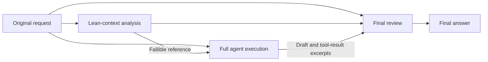

# DSH Reasoning Support

English | [简体中文](README.zh-CN.md)

An optimization plugin for **DSV4.1** in [DeepSeek Harness (DSH)](https://github.com/deepseek-ai/deepseek-harness). Its goal is to bring DSV4.1's reasoning performance closer to minimal mode while retaining the tools and workflows of a full agent.

## What it is for

DSV4.1 can sometimes solve a problem in minimal mode, yet miss a condition or fall back on a familiar answer when working with a full agent's tools, skills, and project context. This project targets that gap, helping the model make better use of its existing comprehension and reasoning abilities in a complete working environment.

Keep file access, shell commands, Skills, and project rules while giving DSV4.1 a separate analysis pass in a lean context and a review before delivery. The aim is to approach minimal-mode problem-solving performance while retaining the ability to carry out real tasks.

## How it works

A lean analysis pass runs before the full agent executes the task, followed by a review before the final response. All three stages use the current DSV4.1 model route.



1. **Lean analysis**: use the original request and relevant conversation context to produce a candidate answer or an approach to the task.
2. **Full execution**: the main agent considers the request and reference, then uses its full tool set to answer questions, work with files, or complete engineering tasks.
3. **Final review**: check the task's conditions, reference, draft, and tool-result excerpts to produce the answer shown to the user.

Skill catalogs are also loaded on demand to reduce automatically expanded instructions. Native tools and project rules remain available.

A simple question usually takes **1 primary call + 2 auxiliary calls**. Engineering tasks may also require tool loops. The extra analysis and review increase response time and usage; results vary by task.

## Installation and activation

You need Node.js **24 or newer** and a DSH installation with a configured model provider. The tested environment is Windows, Node.js 24.18.0, and DSH 0.1.5-rc.1.

**Recommended: create an independent preset based on Standard, then enable the plugins in that preset.** The installer creates the **Reasoning Support** preset for you.

```sh
git clone https://github.com/Yu1Ko/dsh-reasoning-support.git
cd dsh-reasoning-support
node ./install.mjs
```

Start a new session and select **Reasoning Support** with **DSV4.1**.

To use this preset by default for new sessions:

```sh
node ./install.mjs --set-default
```

The usual Windows global npm location is detected automatically. For other installation locations or operating systems, supply the path to the installed DSH package's `package.json`:

```sh
node ./install.mjs --dsh-package "/absolute/path/to/@deepseek-ai/dsh/package.json"
```

<details>
<summary>More installation options</summary>

- `--dsh-home PATH`: DSH data directory; also configurable through `DSH_HOME`.
- `--dsh-package PATH`: DSH package path; also configurable through `DSH_PACKAGE`.
- `--set-default`: select Reasoning Support as the default preset for new sessions.
- `--expect-default ID`: change the default only if its current value matches the specified preset.

</details>

## Supported models

Analysis and review are enabled for **DSV4.1** with these model identifiers:

- `deepseek-v4.1`, `deepseek-v41`, and variants with a suffix beginning with `-`.
- Corresponding identifiers with a routing prefix, such as `codebuddy/deepseek-v4.1-flash`.
- `deepseek-flash` under the `deepseek-official` provider, displayed as `DeepSeek-V41-Flash` in the tested DSH model catalog.

Other models skip the two auxiliary calls.

## Usage notes

- Add **"Do not make extra model calls"** to a request to temporarily disable analysis and review.
- Images, attachments, visual conversation history, child agents, and oversized inputs skip auxiliary calls.
- If an auxiliary call fails or returns unusable output, the available primary answer is preserved.
- Stage answers, durations, and auxiliary usage are recorded under `storages/reasoning-support-audit` in the DSH data directory, so you can inspect results and call overhead.

## Rollback

Installation creates a configuration backup and prints a `receiptPath`. Use that path to restore the configuration:

```sh
node ./install.mjs --rollback "/path/to/installation.json"
```

Rollback checks for configuration changes made after installation and retains existing sessions, runtime files, and call records.

## Development and tests

```sh
npm test
npm run check
```

Tests cover runtime behavior, installation, and rollback, with additional live DSH integration checks documented in the [validation notes](docs/VALIDATION.md). After editing runtime code, run `npm run manifest` to update the content manifest.

## License

[MIT](LICENSE). See [THIRD_PARTY_NOTICES.md](THIRD_PARTY_NOTICES.md) for third-party notices.
