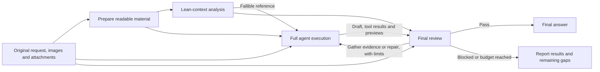

# DSH Reasoning Support

English | [简体中文](README.zh-CN.md)

An optimization plugin for **DSV4.1** in [DeepSeek Harness (DSH)](https://github.com/deepseek-ai/deepseek-harness). Its goal is to bring DSV4.1's reasoning performance closer to minimal mode while retaining the tools and workflows of a full agent.

## What it is for

DSV4.1 can sometimes solve a problem in minimal mode yet miss a condition amid a full agent's tools, skills and project context. This project targets that gap: provide a lean analysis context, let the full agent execute, and check the result before delivery.

Use it for everyday questions, screenshot-driven creation, and engineering tasks with documents, source files or other attachments. Images and attachments enter the auxiliary pipeline. When acceptance finds a concrete gap, the main agent can gather evidence, repair the artifact and obtain another review within the same user turn.

## How it works

The plugin has two independent mechanisms: the **analysis pipeline** (extra model calls that only shape text) and the **adaptive tool context** (which decides the tools the main agent can see). Either can be turned off on its own.

### Analysis pipeline

A lean analysis pass runs before implementation, followed by a review before the final response. Each stage uses the selected DSV4.1 model route.



1. **Prepare material:** retain original images and read supported text attachments. For other formats, the main agent obtains readable content or previews with native tools.
2. **Lean analysis:** use the original request, relevant context and available material to produce a candidate answer or a short execution brief with acceptance criteria.
3. **Full execution:** the main agent uses native tools, Skills and project rules to create artifacts and obtain verification evidence.
4. **Acceptance and repair:** distinguish pass, missing evidence, concrete defects and blockers. Gather missing evidence before changing an implementation; return verified defects to the main agent for repair and review again.

Review feedback is fallible and cannot grant permissions. Ordinary tool iterations do not repeat the initial analysis pass, and this pipeline does not change the main agent's tool list.

### Adaptive tool context

`adaptive-context.mjs` rewrites the tool list for the current request when the system prompt is assembled (`system-prompt/assemble`). It is **on by default** (the `reasoning-support-adaptive-context` preset entry sets `allTools: false`):

- **Native tools only at first:** the built-ins in `NATIVE_TOOLS`, plus the `tool_search` and `skill_search` tools the plugin registers. Third-party plugins, MCP and domain tools stay out of the list.
- **Discovery on demand:** `tool_search` matches names and descriptions across the full tool catalog (at most 5 results per call). Matching non-native tools join that agent's selection set and become directly callable through their native schemas in the next step.
- **Selection bound:** the most recent 12 entries are kept (`maxAdditionalTools`, configurable 5–100).
- **Restored across compaction:** after context compaction the selection set is rebuilt from this session's successful `tool_search` results.
- **Scoped per session and agent:** selection sets never leak between agents.
- **Skills are discovered, not injected:** `skill_search` returns names and descriptions only; a body still loads through the native `skill` tool. While discovery is active, the automatically injected skill catalog is compacted to one short line.

To keep the full tool list at all times, set `allTools: true` on that preset entry, which turns the filtering off; the plugin's reasoning guidance still applies.

## Images and attachments

- **Images:** original references enter analysis and review. Tool-generated screenshots and renders can enter acceptance with separate provenance. Text follow-ups to image conversations remain supported.
- **Text and source files:** the DSH attachment service reads and verifies the complete bytes before providing text. Direct reading supports UTF-8 files up to 2 MiB by default; long text is explicitly marked as an excerpt.
- **PDF, Office, model files and archives:** the main agent uses available local parsers, then reads the extracted text or previews. Producing a file, checking its size or reporting a page count is not equivalent to supplying its contents.
- **Long input:** auxiliary context is excerpted within a budget, with omissions marked. The plugin does not rewrite the main agent's original input. Each auxiliary request retains at most 16 images.

A custom parser can place extracted text or previews in a temporary path containing the original attachment's SHA-256 hash, then inspect them through `read`, `read_image`, or a `Get-Content` / `cat` command that displays the contents. This associates the result with its source. Scanned PDFs need page images or OCR; specific formats need suitable local tools. Unread, unparsed and omitted material is not verified evidence.

**The selected DSH provider route must also declare image input.** With `llm-pi-ai`, add this field to the existing DSV4.1 model entry, preserving its other fields:

```yaml
input: [text, image]
```

The plugin checks the capability bound to the actual adapter call. A text placeholder in place of an image is not recorded as successful visual acceptance.

## Installation and activation

You need Node.js **24 or newer** and DSH with a configured model provider. The tested environment is Windows, Node.js 24.18.0, and DSH 0.1.5-rc.1.

**Recommended: create an independent preset based on Standard, then enable the plugins in that preset.** The installer creates the **Reasoning Support** preset for you.

```sh
git clone https://github.com/Yu1Ko/dsh-reasoning-support.git
cd dsh-reasoning-support
node ./install.mjs
```

You can also extract a release archive and run the installer. Start a new session and select **Reasoning Support** with **DSV4.1**.

To use the preset by default for new sessions:

```sh
node ./install.mjs --set-default
```

The usual Windows global npm location is detected automatically. For other locations or operating systems, specify the installed DSH package:

```sh
node ./install.mjs --dsh-package "/absolute/path/to/@deepseek-ai/dsh/package.json"
```

Other options: `--dsh-home PATH` selects the DSH data directory; `--expect-default ID` changes the default only if its current value matches. `DSH_HOME` and `DSH_PACKAGE` environment variables can also supply paths.

## Cost and limits

The normal flow is **N primary calls + 1 analysis + 1 initial acceptance + R follow-up reviews**, or **N + 2 + R**. `N` includes material preparation, tool iterations, evidence gathering and repairs. Internal repairs do not restart the analysis pass.

Defaults allow at most **2 repair/evidence rounds followed by review**. No new repair rounds are added after five minutes from the first acceptance attempt. An individual auxiliary call times out after 150 seconds. No new auxiliary calls start once reported auxiliary usage reaches 200,000 tokens; each call allows at most 32,768 output tokens. These limits govern the plugin's additional work and do not forcibly terminate a running primary tool.

Repeated feedback without new evidence or artifact changes stops repairs early. Cancellation, new user input, stale results and parsing failures have separate handling. If engineering acceptance remains incomplete, the main agent reports the actual results and unverified requirements in the requested output format.

**Milestone review is off by default.** To review a rough model or a first working page, set `checkpoint: true` in the installed `final-review.mjs` entry's `config`. The main agent can call `reasoning_support_checkpoint`, spending at most one milestone review per user request. Count that separately as `K`: **N + 2 + R + K**.

Add **“Do not make extra model calls”** to temporarily opt out. **“For the rest of this conversation, do not make extra model calls”** persists until an explicit **“Re-enable extra model calls”**. Child agents do not add another copy of this auxiliary pipeline. Counts refer to logical calls; provider-internal retries and billing remain governed by the provider's records.

Stage states, answers, timings and auxiliary usage are recorded in `storages/reasoning-support-audit` under the DSH data directory.

## Supported models

The auxiliary pipeline targets **DSV4.1** with these identifiers:

- `deepseek-v4.1`, `deepseek-v41`, and variants with a suffix beginning with `-`.
- Corresponding identifiers with a route prefix, such as `codebuddy/deepseek-v4.1-flash`.
- `deepseek-flash` under `deepseek-official`, displayed as `DeepSeek-V41-Flash` in the tested DSH catalog.

Other models do not trigger auxiliary calls. See the [validation notes](docs/VALIDATION.md) for tested paths and actual transport observations. Current validation establishes functionality and integration; it does not quantify equal-budget reasoning accuracy or engineering success-rate improvements.

## Rollback

Installation creates a backup and prints a `receiptPath`:

```sh
node ./install.mjs --rollback "/path/to/installation.json"
```

Rollback checks for subsequent configuration edits and retains existing sessions, runtime files and call records.

## Development and tests

```sh
npm test
npm run check
npm run test:native -- --dsh-package "/absolute/path/to/@deepseek-ai/dsh/package.json"
```

Regular tests need no model account. Native integration tests use the real DSH loop, file tools and attachment service with a deterministic local provider. The PDF case requires Python and `pypdf`; `DSH_TEST_PYTHON` can select Python. After changing runtime code, run `npm run manifest` to update the content manifest.

See the [design notes in Chinese](docs/IMPROVEMENT_PLAN.zh-CN.md) for implementation and acceptance details.

## License

[MIT](LICENSE). See [THIRD_PARTY_NOTICES.md](THIRD_PARTY_NOTICES.md) for third-party notices.
