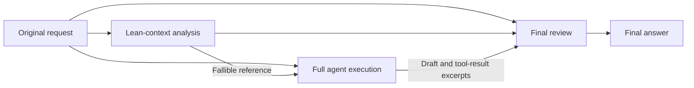

# DSH Reasoning Support

English | [简体中文](README.zh-CN.md)

Context shaping and optional same-model reasoning passes for [DeepSeek Harness (DSH)](https://github.com/deepseek-ai/deepseek-harness). The project keeps the normal tool-using agent and adds a lean advisory pass before execution and a review pass before the final answer. It supplies no fixed roleplay identity.

**Recommended: create an independent preset based on Standard, then enable these plugins in that preset.** A preset is an agent configuration, not necessarily a persona. The installer creates a neutral **Reasoning Support** preset from a bundled Standard composition snapshot, so you do not need to assemble several presets or edit the built-in Standard preset.

## What it is for

- Questions where exact wording, constraints, available information, or permitted choices matter.
- Engineering tasks that still need real file inspection, editing, shell commands, and verification.
- Experiments comparing an agent's draft with a separate advisory answer and final review, with explicit accounting for the extra calls.

The working hypothesis is that a smaller advisory context can help a model retain task-relevant conditions when a full agent environment contains many tool and skill descriptions. Extra inference may also help. These contributions have not been isolated in an equal-budget evaluation, and review can introduce errors as well as repair them.

## Design

All model stages use the selected model route; they do not call a separate stronger model to supply the answer.



1. **Shape the agent context.** Keep native tools, project rules, and caller-supplied style. Replace the automatically injected skill catalog with on-demand skill discovery. Put first-party tool guidance with its corresponding tool description and keep the current user request last among this step's contributed messages.
2. **Generate advice.** Send the original request, prior public conversation text, and available compaction checkpoints to a tool-free invocation of the same model. It returns a candidate answer or an inspection plan. It cannot inspect files or establish that work was completed.
3. **Run the full agent.** The main agent receives the original request and the explicitly fallible advice, and uses the normal DSH tool and permission mechanisms.
4. **Review the final text.** The reviewer receives the request, advice, draft, and recent tool-result excerpts. A complete usable review replaces the delivered text. This is another model judgment, not a deterministic proof checker. Tool-call responses keep their native streaming path.
5. **Record the stages.** Public advice, the original draft, reviewed text, status, duration, and available usage go into separate JSONL audit files. No custom events are added to DSH's versioned session journal.

For a simple text question this usually means **1 primary call + 2 auxiliary calls**. Engineering work may require many primary tool-loop calls in addition to those two. Text awaiting final review is buffered, so the final answer can take longer to appear.

## Applicable models

Version `0.1.0` is persona-neutral; automatic auxiliary inference is currently gated to the DSV4.1 identifiers in [`runtime/target-model.mjs`](runtime/target-model.mjs):

- Provider `deepseek-official`, model `deepseek-flash`. The tested DSH catalog labels this route `DeepSeek-V41-Flash`; check your own provider catalog before relying on that alias.
- A model name `deepseek-v4.1` or `deepseek-v41`, optionally followed by a `-` variant suffix and preceded by a `/`-separated prefix. `codebuddy/deepseek-v4.1-flash` is an exercised example.

A recognized identifier enables the middleware; it is not proof that every provider behind that name is equivalent or that every such route was tested. Other model identifiers skip the two auxiliary passes. The selected preset's context shaping and native tools still apply. Support for additional model families requires an explicit matcher change and new validation.

Images, files, visual conversation history, child agents, oversized analysis inputs, and explicit extra-call opt-outs also skip auxiliary inference. To opt out for a text turn, say **"Do not make extra model calls"** or **"不要额外模型调用"**. Strict JSON and other explicit output formats take precedence over stylistic additions.

## Installation and activation

Requirements:

- Node.js **24 or newer**.
- An initialized DSH installation with its own configured model provider and credentials.
- A DSH build exposing `isAgentLoopRequest`; the integration was developed against **DSH 0.1.5-rc.1**. The bundled base composition is a snapshot of that version, not a live inheritance link to future Standard presets.

```sh
git clone https://github.com/Yu1Ko/dsh-reasoning-support.git
cd dsh-reasoning-support
node ./install.mjs
```

For the usual Windows global npm installation, DSH's package location is detected automatically. For other locations or operating systems, supply the path to the installed DSH package:

```sh
node ./install.mjs --dsh-package "/absolute/path/to/@deepseek-ai/dsh/package.json"
```

The installer writes its own preset, runtime files, and backup receipt. **Installation alone does not enable the plugins in every existing agent preset.** Start a **new session** and choose **Reasoning Support** with a supported model.

To make it the default for new sessions:

```sh
node ./install.mjs --set-default
```

Available options:

- `--dsh-home PATH`: DSH data directory; defaults to `DSH_HOME` or the current user's `.dsh` directory.
- `--dsh-package PATH`: DSH `package.json`; `DSH_PACKAGE` is also accepted.
- `--set-default`: select the new preset as the default; provider and model settings remain unchanged.
- `--expect-default ID`: with `--set-default`, fail if the existing default differs from the expected preset.
- `--rollback RECEIPT`: restore the configuration using the original installation receipt.

The preset ID is `reasoning-support`. Existing sessions retain their original preset. Advanced users can explicitly add the plugin rows to an existing **custom** preset, but should avoid duplicate registration; this installer deliberately creates a separate preset.

## Rollback

Every installation prints a `receiptPath` beneath `.reasoning-support-backups` in the DSH data directory. Keep that original file:

```sh
node ./install.mjs --rollback "/path/printed/by/the/installer/installation.json"
```

The receipt is saved before live configuration changes, so interrupted installations can also be recovered. Rollback refuses to overwrite modified preset files and preserves later user changes to the default selection. Versioned runtime directories, audits, and sessions remain available for already-running sessions.

## Validation and limitations

No npm dependencies or provider calls are needed for the automated tests:

```sh
npm test
npm run check
```

Tests cover route selection, cancellation, tool-stream preservation, context continuity, audit isolation, and installation/rollback with a local DSH API fixture. See [validation notes](docs/VALIDATION.md) for what was checked against a real DSH installation and what remains unverified.

- Extra calls increase latency and token usage; retries may increase HTTP request counts further.
- Auxiliary failure or unusable review output preserves the available primary answer. Audit persistence failure also prevents applying unaudited auxiliary output.
- Input to the advisory pass is capped at 48,000 characters; the reviewer uses recent excerpts, not the complete contents of all files or tool results.
- A model can repeat a mistaken assumption across all three stages. Correct conclusions do not guarantee complete reasoning.
- The project has not established broad task-success improvements at equal cost or a general engineering speedup.
- No puzzle names, expected answers, or task-specific numerical solutions are embedded in runtime rules.

## Audit privacy and development

Audits are written to `storages/reasoning-support-audit` inside the selected DSH data directory. They contain request-related public answer text and may contain private project information. A hashed filename is not anonymization. Keep audit files and installation receipts out of public repositories.

Primary context-occupancy usage is preserved; auxiliary usage is recorded separately. An interrupted provider response may omit usage, which means **unknown**, not zero.

After intentional runtime edits, regenerate and check the content manifest:

```sh
npm run manifest
npm test
npm run check
```

The versioned runtime path avoids reusing stale module imports for newly mounted presets. No particular persona or language is required by the runtime.

## License

[MIT](LICENSE). The original DeepSeek MIT notice for the derived base composition is preserved in [third-party notices](THIRD_PARTY_NOTICES.md).
