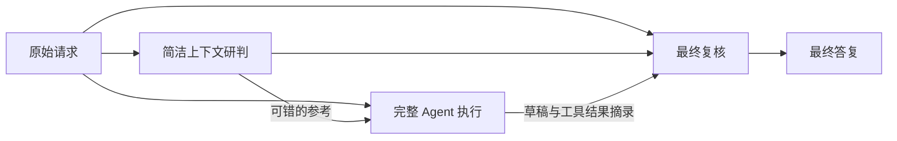

# DSH Reasoning Support

[English](README.md) | 简体中文

针对 **DSV4.1** 的 [DeepSeek Harness（DSH）](https://github.com/deepseek-ai/deepseek-harness) 优化插件。目标是在保留完整 Agent 工具和工程流程的同时，让 DSV4.1 的推理表现更接近极简模式。

## 用途

同一个 DSV4.1，有时能在极简模式下解出问题，却在完整 Agent 的工具、技能和项目上下文中遗漏条件或套用熟悉的答案。这个项目针对这种表现落差，让模型在完整工作环境中，更充分地发挥它已有的理解和推理能力。

你可以继续使用文件读写、命令执行、Skills 和项目规则，同时给 DSV4.1 增加一次简洁环境下的独立研判，以及一次输出前的复核。优化重点是缩小与极简模式之间的解题表现差距，兼顾推理质量与实际执行任务的能力。

## 工作原理

在完整 Agent 执行任务之前增加一次简洁研判，在最终答复之前增加一次复核。三个阶段均使用当前的 DSV4.1 模型路线。



1. **简洁研判**：围绕原始请求和必要的对话上下文，先给出候选答案或执行思路。
2. **完整执行**：主 Agent 结合原始请求与参考，使用完整工具完成问答、文件操作或工程任务。
3. **最终复核**：核对题目条件、参考、主答复和工具结果摘录，生成最终展示的答复。

此外，技能目录改为按需查询，减少每轮自动展开的说明；原生工具和项目规则继续保留。

普通问答通常是 **1 次主调用＋2 次辅助调用**。工程任务还会按需进行工具循环。额外研判与复核会增加响应时间和用量，具体效果因任务而异。

## 安装与启用

需要 Node.js **24 或更新版本**，以及已经配置好模型提供方的 DSH。已验证环境为 Windows、Node.js 24.18.0、DSH 0.1.5-rc.1。

**建议基于标准模式新建一个独立预设，再在新预设中启用插件。** 安装器会自动创建 **Reasoning Support** 预设。

```sh
git clone https://github.com/Yu1Ko/dsh-reasoning-support.git
cd dsh-reasoning-support
node ./install.mjs
```

安装后新建会话，选择 **Reasoning Support** 和 **DSV4.1** 即可使用。

如果希望新会话默认使用该预设：

```sh
node ./install.mjs --set-default
```

Windows 上常见的全局 npm 安装位置可自动识别。使用其他位置或操作系统时，指定已安装 DSH 的 `package.json` 路径：

```sh
node ./install.mjs --dsh-package "/absolute/path/to/@deepseek-ai/dsh/package.json"
```

<details>
<summary>更多安装选项</summary>

- `--dsh-home PATH`：指定 DSH 数据目录；也可设置 `DSH_HOME`。
- `--dsh-package PATH`：指定 DSH 包路径；也可设置 `DSH_PACKAGE`。
- `--set-default`：将 Reasoning Support 设为新会话的默认预设。
- `--expect-default ID`：仅在当前默认预设符合指定值时继续修改。

</details>

## 适用模型

本项目针对 **DSV4.1** 启用研判与复核，支持以下模型标识：

- `deepseek-v4.1`、`deepseek-v41` 及其以 `-` 开头的后缀变体。
- 带路由前缀的对应标识，例如 `xxxxx/deepseek-v4.1-flash`。
- `deepseek-official` 提供方下的 `deepseek-flash`，在已验证的 DSH 模型目录中显示为 `DeepSeek-V41-Flash`。

其他模型会跳过这两次辅助调用。

## 使用说明

- 在当前请求中加入 **“不要额外模型调用”**，即可临时关闭研判与复核。
- 图片、附件、含视觉信息的历史、子代理和过长输入会跳过辅助调用。
- 辅助调用失败或输出不可用时，保留主 Agent 的可用答复。
- 各阶段答案、耗时和辅助用量记录在 DSH 数据目录的 `storages/reasoning-support-audit`，方便查看结果与调用开销。

## 回退

安装时会生成配置备份，并输出 `receiptPath`。使用该路径恢复：

```sh
node ./install.mjs --rollback "/path/to/installation.json"
```

回退会检查安装后的配置是否被再次修改，并保留已有会话、运行时和调用记录。

## 开发与测试

```sh
npm test
npm run check
```

测试覆盖运行时行为、安装与回退，另有真实 DSH 集成验证，详见[验证记录](docs/VALIDATION.md)。修改运行时代码后，运行 `npm run manifest` 更新校验清单。

## 许可

[MIT](LICENSE)。第三方组件声明见 [THIRD_PARTY_NOTICES.md](THIRD_PARTY_NOTICES.md)。
