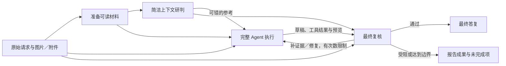

# DSH Reasoning Support

[English](README.md) | 简体中文

针对 **DSV4.1** 的 [DeepSeek Harness（DSH）](https://github.com/deepseek-ai/deepseek-harness) 优化插件。目标是在保留完整 Agent 工具和工程流程的同时，让 DSV4.1 的推理表现更接近极简模式。

## 用途

同一个 DSV4.1，有时能在极简模式下解出问题，却在完整 Agent 的工具、技能和项目上下文中遗漏条件。这个项目针对这种表现落差：给模型一个简洁的研判环境，再让完整 Agent 执行，并在交付前检查结果。

可以用于日常问答、截图驱动的制作任务，以及带文档、代码或其他附件的工程任务。图片和附件会进入辅助流程；工程验收发现缺项时，可以让主 Agent 在同一轮中补检、修复并重新验收。

## 工作原理

插件由两条互相独立的链路组成：**推理研判流水线**（额外的模型调用，只影响文本输出）和**自适应工具上下文**（决定主 Agent 本轮能看到哪些工具）。两者可以分别关闭。

### 推理研判流水线

在完整 Agent 实施任务之前增加一次简洁研判，在最终答复之前增加一次复核。各阶段使用当前选中的 DSV4.1 模型路线。



1. **准备材料**：保留原图；直接读取可处理的文本附件。其他格式先由主 Agent 使用读取、解析或预览工具取得内容。
2. **简洁研判**：围绕原始请求、相关上下文和已读材料，给出候选答案或简短执行思路、验收项。
3. **完整执行**：主 Agent 使用原生工具、Skills 和项目规则完成任务，取得实际产物与检查结果。
4. **验收与修复**：复核区分通过、缺少证据、需要修复和受阻。缺证据时先补检查；具体缺陷交回主 Agent 修复，再重新验收。

复核意见是可错的参考，不能扩大用户授权。工具循环不会反复运行前置研判；这条链路不修改主 Agent 的 tools 列表。

### 自适应工具上下文

`adaptive-context.mjs` 在组装系统提示时（`system-prompt/assemble`）重写本次请求的工具表，**默认开启**（预设条目 `reasoning-support-adaptive-context` 中为 `allTools: false`）：

- **首轮只暴露原生工具**：`NATIVE_TOOLS` 中的内置工具，加上插件自注册的 `tool_search` 与 `skill_search`。三方插件、MCP 和领域工具默认不进入工具表。
- **按需检索**：`tool_search` 在完整工具目录里按名称和描述匹配（单次最多返回 5 条），命中的非原生工具写入该 Agent 的选择集，下一步即以原生 schema 直接可调用。
- **选择集上限**：默认保留最近 12 个（`maxAdditionalTools`，可配置 5–100）。
- **跨压缩恢复**：上下文压缩后，从本会话成功的 `tool_search` 结果重建选择集。
- **按会话／Agent 隔离**：选择集互不泄漏，一个会话检索出的工具不会出现在另一个会话。
- **技能只发现、不注入正文**：`skill_search` 只返回技能名与描述，正文仍需用原生 `skill` 工具加载；此时原本自动注入的技能目录消息会被压缩为一句短提示。

要让工具表始终完整，把该预设条目的 `allTools` 改为 `true`，即关闭裁剪；插件写入的推理指导在此期间仍然生效。

## 图片与附件

- **图片**：原图引用进入研判和复核；工具产生的截图、渲染图也能进入验收，并与原始参考图区分。上传图片后的文字追问继续支持辅助调用。
- **文本与代码附件**：通过 DSH 附件服务完整读取并校验后提供正文。默认直接读取最多 2 MiB 的 UTF-8 文件；较长正文会明确标记为摘录。
- **PDF、Office、模型文件、压缩包等**：由主 Agent 使用环境中可用的解析工具处理，再读取正文或预览。写出解析文件、查询大小或列出页数，不等于模型已经看到了内容。
- **长输入**：辅助上下文按预算摘录，并标明省略；主 Agent 的原始输入不被插件改写。单次辅助请求最多保留 16 张图片。

自定义解析脚本可以把输出放在含原附件 SHA-256 哈希的临时路径中，再用 `read`、`read_image` 或显示正文的 `Get-Content` / `cat` 读取，方便关联原附件与解析结果。扫描 PDF 需要页面图片或 OCR；具体格式需要相应的本地工具。未读取、未解析或省略的部分不能作为已验证内容。

**图片输入还需要当前 DSH 提供方路线声明图像能力。** 使用 `llm-pi-ai` 时，在对应的既有 DSV4.1 模型条目中配置：

```yaml
input: [text, image]
```

保留该条目原有的其他字段。插件会检查实际调用所绑定的路线能力；图片被替换成文字占位符时，不会记录为视觉验收成功。

## 安装与启用

需要 Node.js **24 或更新版本**，以及已经配置好模型提供方的 DSH。已验证环境为 Windows、Node.js 24.18.0、DSH 0.1.5-rc.1。

**建议基于标准模式新建一个独立预设，再在新预设中启用插件。** 安装器会自动创建 **Reasoning Support** 预设。

```sh
git clone https://github.com/Yu1Ko/dsh-reasoning-support.git
cd dsh-reasoning-support
node ./install.mjs
```

也可以解压本项目的发布包后运行安装命令。安装后新建会话，选择 **Reasoning Support** 和 **DSV4.1**。

需要设为新会话的默认预设时：

```sh
node ./install.mjs --set-default
```

Windows 上常见的全局 npm 安装位置可自动识别；其他位置或系统可以指定路径：

```sh
node ./install.mjs --dsh-package "/absolute/path/to/@deepseek-ai/dsh/package.json"
```

其他选项：`--dsh-home PATH` 指定 DSH 数据目录；`--expect-default ID` 仅在当前默认预设符合指定值时继续修改。也可用 `DSH_HOME`、`DSH_PACKAGE` 环境变量指定路径。

## 调用成本与边界

正常流程为 **N 次主调用＋1 次前置研判＋1 次首次验收＋R 次复验**，即 **N＋2＋R**。`N` 包含材料预读、工具循环、补检和修复；内部修复不会重跑前置研判。

默认最多允许 **2 轮补检／修复后的复验**。从首次验收开始，5 分钟后不再追加修复轮次；单次辅助调用超时为 150 秒。累计已报告的辅助用量达到 200,000 token 后不再发起辅助调用，每次输出上限为 32,768 token。这些限制控制插件增加的工作，不会强行终止正在执行的主 Agent 工具。

重复意见没有带来新的证据或产物变化时，会提前结束修复。取消、新用户要求、过期结果和解析失败也有独立处理。工程验收未完成时，由主 Agent 按原输出格式报告实际成果与未验证项。

**里程碑检查默认关闭。** 需要检查粗模、首个可运行页面等中间产物时，可在安装后 `final-review.mjs` 对应的 `config` 中设置 `checkpoint: true`。主 Agent 可调用 `reasoning_support_checkpoint`，每条用户请求最多增加一次里程碑复核；成本单独计为 `K`，总计 **N＋2＋R＋K**。

在当前请求中加入 **“不要额外模型调用”**，可临时关闭辅助流程。使用 **“本会话一直不要额外模型调用”** 可持续关闭，直到明确要求 **“恢复额外模型调用”**。子代理不叠加这套辅助流程。调用次数为逻辑调用计数；提供方内部重试及计费以其记录为准。

各阶段状态、答案、耗时和辅助用量记录在 DSH 数据目录的 `storages/reasoning-support-audit`。

## 适用模型

本项目针对 **DSV4.1** 启用辅助流程，支持以下标识：

- `deepseek-v4.1`、`deepseek-v41` 及其以 `-` 开头的后缀变体。
- 带路由前缀的对应标识，例如 `codebuddy/deepseek-v4.1-flash`。
- `deepseek-official` 提供方下的 `deepseek-flash`，在已验证的 DSH 模型目录中显示为 `DeepSeek-V41-Flash`。

其他模型不触发辅助调用。已测试范围和实际传输记录见[验证记录](docs/VALIDATION.md)。当前验证覆盖功能和集成路径，尚未给出等预算条件下的正确率或工程成功率提升数值。

## 回退

安装器会生成配置备份并输出 `receiptPath`：

```sh
node ./install.mjs --rollback "/path/to/installation.json"
```

回退会检查安装后的配置是否被再次修改，并保留已有会话、运行时和调用记录。

## 开发与测试

```sh
npm test
npm run check
npm run test:native -- --dsh-package "/absolute/path/to/@deepseek-ai/dsh/package.json"
```

普通测试无需模型账户。原生集成测试使用真实 DSH 循环、文件工具和附件服务，以及确定性的本地测试提供方；PDF 用例需要 Python 与 `pypdf`。可用 `DSH_TEST_PYTHON` 指定 Python。运行时代码修改后执行 `npm run manifest` 更新校验清单。

实现细节与验收思路见[设计记录](docs/IMPROVEMENT_PLAN.zh-CN.md)。

## 许可

[MIT](LICENSE)。第三方组件声明见 [THIRD_PARTY_NOTICES.md](THIRD_PARTY_NOTICES.md)。
