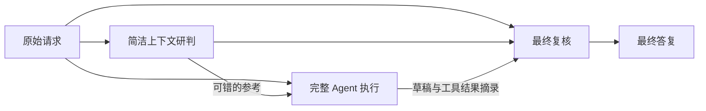

# DSH Reasoning Support

[English](README.md) | 简体中文

面向 [DeepSeek Harness（DSH）](https://github.com/deepseek-ai/deepseek-harness) 的上下文整理与同模型推理辅助插件。在完整 Agent 执行任务之前增加一次简洁研判，在最终答复之前增加一次复核。核心实现不绑定固定 RP 人设。

**建议基于标准模式新建一个独立预设，再在新预设中启用这些插件。** 预设是 Agent 的配置组合，不等同于人设。安装器已经按这个方式，基于随包附带的标准模式配置快照生成中性的 **Reasoning Support** 预设；无需搭配多个实验预设，也无需修改内置标准模式。

## 用途

- 对题目措辞、约束、已知信息和允许选择较敏感的问答任务。
- 仍需实际查看文件、修改代码、执行命令和验证结果的工程任务。
- 对比独立参考、主 Agent 草稿和最终复核，并明确统计额外调用的实验。

设计假设是：完整 Agent 环境包含较多工具和技能说明，额外提供一个较简洁的研判环境，可能有助于模型抓住任务条件。增加推理调用本身也可能产生作用。目前尚未用等预算评估分离这些因素，复核也可能引入错误。

## 设计原理

各阶段沿用所选模型路线，不另用更强的模型提供答案。



1. **整理上下文。** 保留原生工具、项目规则和调用方已有的表达偏好；自动注入的技能长目录改为按需查询；将内置工具的说明放到对应工具描述中，并将当前用户请求放到本步骤各项补充消息的最后。
2. **生成独立参考。** 同一模型在无工具的调用中读取原始请求、历史公开对话文本及可用的压缩摘要，给出候选答案或检查计划。它不能查看文件，也不能据此证明任务已经完成。
3. **完整 Agent 执行。** 主 Agent 同时收到原始请求和明确标记为“可能出错”的参考，继续使用 DSH 原有的工具及权限机制完成实际工作。
4. **复核最终文字。** 复核调用读取请求、参考、草稿和最近的工具结果摘录；得到完整可用的输出后，用它替换最终答复。这仍是模型判断，并非确定性的证明检查器。工具调用响应保留原生流式处理路径。
5. **记录各阶段。** 公开参考、原草稿、复核文字、状态、耗时和可取得的用量写入独立 JSONL 文件，不向 DSH 的版本化会话日志加入自定义事件。

普通纯文本问答通常是 **1 次主调用＋2 次辅助调用**。工程任务可能在两次辅助调用之外进行多次主调用和工具循环。等待最终复核时文字会被缓冲，因此用户可能更晚看到最终答复。

## 适用模型

`0.1.0` 版已经解除固定人设绑定；额外研判与复核目前仍由 [`runtime/target-model.mjs`](runtime/target-model.mjs) 限定在以下 DSV4.1 标识：

- 提供方 `deepseek-official`，模型 `deepseek-flash`。用于开发验证的 DSH 目录将其显示为 `DeepSeek-V41-Flash`；使用其他目录或版本时，应核对实际提供方的映射。
- 模型名称为 `deepseek-v4.1` 或 `deepseek-v41`，后面可带 `-` 开头的变体后缀，前面可带 `/` 分隔的前缀。已执行过调用的例子是 `codebuddy/deepseek-v4.1-flash`。

名称匹配只表示会启用中间处理逻辑，不代表每家同名提供方都等价或都经过测试。其他模型标识会跳过这两次辅助调用；所选预设的上下文整理和原生工具仍然适用。增加其他模型家族需要明确修改匹配逻辑并重新验证。

图片、文件、含视觉信息的历史、子代理、过长研判输入和显式关闭额外调用的回合，也会跳过辅助推理。可在当轮明确说 **“不要额外模型调用”** 或 **“Do not make extra model calls”**。严格 JSON 等明确格式要求优先于表达风格。

## 安装与启用

前提条件：

- Node.js **24 或更新版本**。
- 已初始化 DSH，并在 DSH 中配置自己的模型提供方和凭据。
- DSH 提供 `isAgentLoopRequest` 接口；集成开发基于 **DSH 0.1.5-rc.1**。附带的基础配置是该版本的标准模式快照，不会自动继承未来版本的标准预设变化。

```sh
git clone https://github.com/Yu1Ko/dsh-reasoning-support.git
cd dsh-reasoning-support
node ./install.mjs
```

Windows 上常见的全局 npm 安装位置可自动识别。使用其他位置或操作系统时，显式提供已安装 DSH 包的路径：

```sh
node ./install.mjs --dsh-package "/absolute/path/to/@deepseek-ai/dsh/package.json"
```

安装器写入独立预设、运行时文件和备份回执。**安装不会让所有现有 Agent 预设自动启用插件。** 请新建会话，选择 **Reasoning Support**，并使用受支持的模型。

若要作为新会话的默认预设：

```sh
node ./install.mjs --set-default
```

可用参数：

- `--dsh-home PATH`：DSH 数据目录；默认读取 `DSH_HOME`，否则使用当前用户的 `.dsh`。
- `--dsh-package PATH`：DSH 的 `package.json` 路径；也接受 `DSH_PACKAGE` 环境变量。
- `--set-default`：将新预设设为默认；不修改提供方和模型设置。
- `--expect-default ID`：配合 `--set-default`，在现有默认预设不符合预期时停止。
- `--rollback RECEIPT`：使用原始安装回执恢复配置。

预设 ID 为 `reasoning-support`。已有会话继续使用原来的预设。熟悉 DSH 的用户也可把对应插件行明确接入自己的**自定义预设**，注意避免重复注册；本安装器采用新建独立预设的方式。

## 回退

每次安装都会输出 `receiptPath`，位于 DSH 数据目录下的 `.reasoning-support-backups` 中。保留原始回执文件：

```sh
node ./install.mjs --rollback "/path/printed/by/the/installer/installation.json"
```

回执在改写实际配置前保存，因此中途失败也能恢复。回退会拒绝覆盖已被修改的预设文件，并保留用户之后改变的默认选择。版本化运行时目录、审计及会话会保留，以兼容仍在使用旧版本的活动会话。

## 验证与限制

自动化测试无需安装 npm 依赖，也不会调用模型提供方：

```sh
npm test
npm run check
```

测试覆盖路线选择、取消、工具流保留、上下文延续、审计隔离，以及使用本地 DSH API 测试替身的安装和回退。真实 DSH 环境中完成的检查与未验证部分见[验证记录](docs/VALIDATION.md)。

- 额外调用增加耗时和 token 用量；网络重试还可能增加 HTTP 请求次数。
- 辅助调用失败或输出不可用时，保留可用的主答复；审计写入失败时也不会应用无法留档的辅助输出。
- 独立研判输入上限为 48,000 个字符；复核使用最近的工具结果摘录，不拥有所有文件和工具输出的完整内容。
- 同一模型可能在三个阶段重复同一种错误假设；结论正确也不代表推理完整。
- 尚未证实等预算下广泛任务成功率的提升，也未证实工程任务普遍提速。
- 运行时规则没有嵌入具体智力题名称、标准答案或题目数字。

## 审计隐私与开发

审计位于所选 DSH 数据目录的 `storages/reasoning-support-audit`。其中包含与请求相关的公开答复文字，也可能包含私人项目信息。文件名使用哈希不代表内容已匿名化；不要把审计文件和安装回执提交到公开仓库。

主请求的上下文占用计量保持原值，辅助请求用量单独记录。中断的提供方响应可能没有完整用量，此时应理解为**未知**，不能当作零消耗。

有意修改运行时代码后，重新生成并校验内容清单：

```sh
npm run manifest
npm test
npm run check
```

版本化运行时路径用于避免新挂载的预设复用旧模块缓存。核心逻辑不要求特定人设或语言。

## 许可

[MIT](LICENSE)。基础组合所衍生的 DeepSeek 原始 MIT 声明保留在[第三方说明](THIRD_PARTY_NOTICES.md)中。
