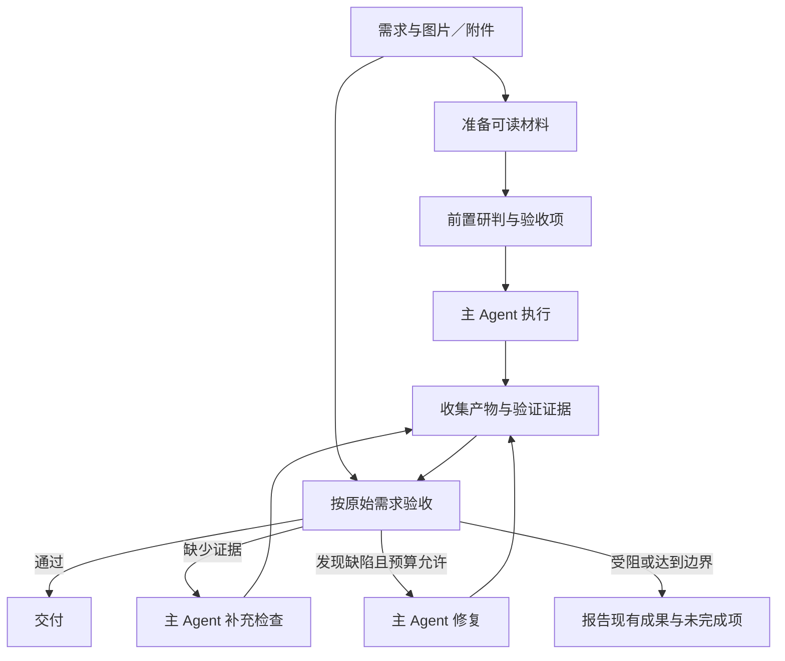

# 图像、附件与工程纠错闭环设计

日期：2026-09-15

状态：0.2.0 已实现；验证范围与结果见 [VALIDATION.md](VALIDATION.md)。

## 1. 0.1.0 中确认的问题

1. **图像进入会话后，核心辅助推理被跳过。** 当前 `analysis-pass.mjs` 会拒绝含图片／文件的输入或历史，`final-review.mjs` 也会绕过含附件的请求。截图建模等任务因此失去前置研判和最终复核。
2. **历史图片会影响后续请求。** 即使当前只输入文字，历史里的图片仍可能导致整轮辅助调用关闭。
3. **附件引用不等于附件内容。** 当前 DSH 会原生发送图片，但普通文件会转成供工具读取的只读文件句柄。仅移除过滤条件，不能让无工具的辅助调用自动理解 PDF、工程文件或压缩包。
4. **最终复核只改答复，没有修复产物。** 当前复核返回的文字会替换主答复；它没有把具体问题交回主 Agent 修改文件、重跑检查。
5. **验收证据不足。** 当前复核主要取得草稿和最近 12 条工具结果的短摘录，可能遗漏失败信息、文件内容或视觉预览。主 Agent 自称完成不能代替产物验收。
6. **测试路线的模态声明需要对齐。** 本次通过 DSH 的模型元数据接口查询，当前测试用 DSV4.1 路线仅声明了 `text`。DSH 会把这类路线的图片转为占位文本，因此还需要核对该路线的图像能力配置，并验证实际请求确实发送了图像数据。修改声明本身不能代替真实图片测试。

## 2. 优化目标

让用户一次提出需求后，系统能够围绕同一任务完成：

**读取材料 → 理解需求 → 执行 → 检查实际产物 → 补证据或修复 → 重新验收 → 交付。**

这里的 oneshot 指无需用户再次指出遗漏并催促修复；内部允许多次模型调用和工具执行。主要衡量产物是否符合要求、是否需要用户追加指令，以及完成它所花费的时间和用量。

## 3. 图像与附件进入推理

### 图像

- 在前置研判和最终复核中保留 DSH 原生 `ImageBlock` 与附件引用，交给现有模型适配器发送原图。
- 保留图片与相邻文字的关系。原始参考图与工具生成的预览分别标记来源，避免把两者混为一谈。
- 工具结果中的截图、渲染图也进入复核。例如建模任务同时提供原图与生成模型的预览。
- 历史图片不再作为关闭开关；按有效上下文保留相关材料，并对因预算省略的材料作明确标记。
- 使用与实际分发绑定的模型能力信息。若某条提供方路线未声明图像输入，记录为路线配置或传输问题，不把丢图后的文字答复视作视觉研判成功。

### 附件

- 文本和代码附件：通过 DSH 附件存储接口读取并校验内容，再提供有界的正文或明确标记的摘录。
- PDF、Office、模型文件、压缩包等：按格式使用可用的读取、解析或预览工具。需要主 Agent 预读时，把该步骤放在主要实施之前；真正取得材料后再进行内容研判。
- 附件较大或暂时不可解析时，保留文件引用、读取状态和缺失信息。允许继续查找合适工具或请求必要资料，不根据文件名猜内容。
- 附件存在本身不关闭整条流程。最终复核取得已解析的内容、验证结果及必要预览；没有读取的部分保持“未验证”。

实现边界：DSV4.1 支持多模态与宿主是否传递材料是两回事。已核对当前 DSH：图片可以原生投影；普通 `FileBlock` 在所有提供方路线中都会转为文件句柄，因此必须补上读取／解析环节。不能声称任意二进制格式都能被直接理解。

## 4. 从改答复升级为验收决策

前置研判输出简短的任务理解、约束和验收项。验收项以用户的原始要求为依据，不能自行扩大需求。遇到截图未展示的结构、尺寸或材质时，保留假设或待确认项。

主 Agent 执行后，复核依据原始需求和实际证据返回结构化决策：

- **通过**：必要验收项有对应证据，可以交付。
- **需要补证据**：缺少文件读取、运行检查、截图或渲染结果；先补检查，不直接认定实现错误。
- **需要修复**：指出具体缺陷、对应需求、证据及复验方法，交回主 Agent 修改。
- **受阻／未完成**：权限、工具、资料不足，或已达到修复边界；说明已完成部分和剩余问题。

证据应来自真实工具记录与产物：变更文件、检查命令与退出状态、必要的文件内容、参考图和结果预览。复核引用的证据必须在收集结果中存在。已知的必要检查失败不能被模型的一句“通过”覆盖。

复核意见也可能出错。没有可复现证据的质疑应先补检查；主 Agent 可以用新证据说明某条意见不成立，避免盲目修改正确实现。

## 5. 主 Agent 修复闭环

实现使用 DSH 现有的 `agent/turn-stopping` 与 `agent.steer()`：停止钩子会在本轮真正结束前等待监听器，新增的下一步消息能让同一 Agent 继续执行。该机制已通过真实 DSH 循环和文件修改验证。

具体职责：

1. 复核模块产生并缓存验收结果；草稿、评审和依据保持可追踪。
2. 完成控制器在停止边界检查结果、任务身份与剩余预算。
3. 需要补检或修复时，以插件来源提交具体清单到同一 Agent 的下一步，不伪装成新的用户需求，也不重新跑整套前置研判。
4. 主 Agent 使用原有工具与权限完成动作，然后重新验收。
5. 通过后才给出正式交付结论。修复中显示明确进度，避免先宣告完成，再悄悄修改产物。

保持现有的最终文字缓冲能力，并验证它与停止钩子的衔接：同一份验收结果只消费一次，不能重复复核或反复注入修复消息。完整工具流、用户要求的输出格式和中途取消仍需保持正常。

## 6. 循环边界与成本

0.2.0 采用以下默认策略：

- 最多 **2 轮补检／修复后的复验**，同时限制额外用量和总等待时间。
- 相同问题反复出现且产物、证据没有变化时，提前停止，报告阻塞原因。
- 用户发来新要求或取消时，旧评审与待执行修复清单失效；不得继续按旧需求修改。
- 复核调用失败时，不循环重做已有工程，也不把未验收产物标为已通过。
- 修复只能使用原任务已有的权限与范围。评审意见不能授予新的删除、发布或外部操作权限。

若主 Agent 一共调用 `N` 次，复验 `R` 次，正常成本为：

**N 次主调用＋1 次前置研判＋1 次首次验收＋R 次复验，即 N＋2＋R。**

`N` 包括资料预读、实施与修复中的主调用。重试等额外尝试另行记录。不能在加入修复循环后仍宣传“永远只多两次”。

仅因新用户需求才重新建立前置研判；内部补检或修复继续使用同一任务身份与验收项。复杂附件需要预读时，预读阶段的主调用计入 `N`，不要在材料尚未读取时先生成一份猜测性的内容分析。

## 7. 可选的里程碑检查

完成交付闭环之后，再增加有限的过程检查，避免每次工具调用都调用评审模型。

- 截图建模：先产出粗模和预览，检查主要轮廓、比例与部件，再做细节和材质。
- 页面实现：首个可运行页面出来后核对布局和关键交互，再做细节。
- 代码任务：关键功能首次跑通或出现重复失败时检查方向。

已实现为可选的 `reasoning_support_checkpoint` 工具，默认关闭。每条用户请求最多增加一次里程碑复核，重复调用工具不会追加模型调用。其用量单独记录，同时计入累计辅助用量限制。

## 8. 实现顺序

1. **打通材料链路**：原图传递、文本附件读取、其他附件解析状态，以及工具结果中的图片／内容回传；取消历史图片的一刀切关闭。
2. **完善验收输入和结果**：收集实际证据，区分通过、补检、修复与受阻。
3. **接入有界修复闭环**：使用原生停止钩子与下一步输入，处理取消、重复意见、预算和过期结果。
4. **评估过程检查**：再决定哪些任务需要里程碑复核。

以上四步均已落地；过程检查保留为显式可选项。

建议模块边界：现有 `analysis-pass.mjs` 保留前置研判职责；`final-review.mjs` 负责验收输出；新增共用的材料／证据组装模块，以及独立的完成控制器。无需重写 DSH 的 Agent 循环。

## 9. 验收这次改进的方法

- 图片任务：在实际提供方请求中确认前置研判和复核都携带图片数据，而非只有占位文字。
- 附件任务：验证文本、代码和代表性文档格式；未解析内容不能被记录为已读取。
- 历史延续：上传图片后继续提出文字要求，不应因历史有图而关闭整个增强流程。
- 结果复核：原图与生成预览同时进入视觉验收，检查反馈确实对应当前产物。
- 工程闭环：故意让首版产物缺少一项要求，确认系统修改真实文件、重新验证，并在通过后结束。
- 补证据分支：没有运行结果时先执行检查，不能仅修改最终说明。
- 边界测试：用户取消、需求更新、文件在评审后变化、重复错误、达到预算和评审失败。
- 效果评估：分别记录首版合格率、自动修复后的交付合格率、用户追加指令次数、耗时与用量；不把更长的最终答复算作工程成功率提升。

设计目标是提高一次需求的实际交付成功率；具体提升幅度要由这些测试和真实任务验证，当前不预设数值。

## 10. 实现与验证要点

- `request-context.mjs` 负责有界公共上下文、原生图片引用、经校验的文本附件、读取证据关联，以及原生会话日志中的工具事实。附件的 `sha256:` 前缀不用于 Windows 文件名，派生路径使用其十六进制哈希。
- `analysis-pass.mjs` 在需要解析的附件尚无内容证据时延后研判。独立 `read` / `read_image`，以及明确显示正文的 `Get-Content` / `cat` 语句可以提供内容；文件大小、页数、字符统计和仅写出解析文件不能解除等待。
- `final-review.mjs` 保留最终答复缓冲，并解析有证据引用的验收决策。辅助调用通过 `prepareCall` 将模型能力查询与实际分发绑定到同一适配器代次。严格 JSON 输出从内部评审对象中解包，不向用户泄漏评审结构。
- `completion-controller.mjs` 消费一次评审意见，以插件来源在同一轮中提交补检或修复清单。无进展、轮数、时间和用量达到边界时，转为事实性报告；取消或新的用户输入使旧决策失效。
- 模型只收到有界工具摘录，失败判断另用完整的本轮工具账本。账本从原生 `tool/call` 和 `tool/result` 事件恢复，不依赖主模型是否仍看得到被压缩的旧结果。
- 评审缓存使用保留顺序的证据指纹；无进展判断使用每项操作的最新结果，区分“失败后成功”与“成功后再次失败”。已成功读取或修改的工作区文件也参与快照检查；最多观察 24 个原生文件工具目标，小于等于 8 MiB 时校验内容哈希，更大文件使用大小和修改时间。这里不宣称持续监控整个工作区。
- 默认最多两轮补检／修复，首次验收后五分钟不再增加修复轮次；单次辅助调用上限 150 秒、32,768 输出 token。累计已报告辅助用量达到 200,000 token 后不再发起辅助调用，前置研判、里程碑和复核均计入。提供方内部重试和实际计费仍以提供方记录为准。
- 临时与会话范围的退出指令分别处理；会话范围指令在上下文压缩后仍从原生用户消息恢复。

本地测试覆盖真实 DSH 的读取、写入、预览、PDF 解析、同轮修复、补证据和里程碑。在线图片测试检查了实际 HTTP 请求中的图片数据；额外 PDF 在线复测遇到提供方超时，未计为通过。具体边界保留在验证记录中。
